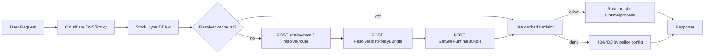
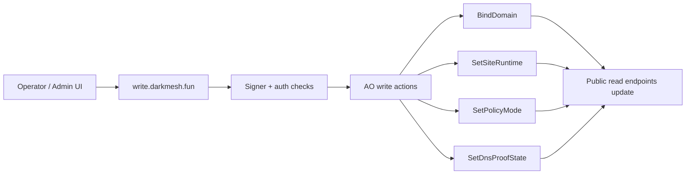

# Darkmesh Resolver Contract v1

Date: 2026-04-22  
Status: Design contract (implementation target)  
Scope: stock HyperBEAM + config/policy routing only (no HB core fork, no Dockerfile fork)

## 1) Purpose

Define a production-grade resolver contract that lets Darkmesh move gateway logic from `-gateway/src` to AO processes while keeping the edge thin and stable.

Key outcomes:
- host -> site resolution is AO-driven,
- policy can stay `off` safely today,
- migration can move to `enforce` later without changing HB source code,
- read path and write/spawn path stay clearly separated.

## 2) Architecture boundaries (gateway-thin)

### 2.1 What the edge does

- Accept request and normalize host/path metadata.
- Call AO-backed resolver/public endpoints.
- Cache decisions for short TTL.
- Return allow/deny and route target.

### 2.2 What the edge does **not** do

- No business-policy authority.
- No on-request mutable admin writes.
- No private key signing.
- No custom HB core patches.

## 3) Authoritative AO endpoint set

The resolver integration must support both legacy read endpoints and new migration endpoints.

### 3.1 Legacy endpoints (still required)

- `POST /api/public/site-by-host`
- `POST /api/public/resolve-route`
- `POST /api/public/page`

### 3.2 New migration endpoints (required for cutover readiness)

- `POST /api/public/GetTemplateActionContract`
- `POST /api/public/GetSiteRuntimeBundle`
- `POST /api/public/ResolveHostPolicyBundle`

## 4) Endpoint contracts (v1)

## 4.1 Common request envelope

```json
{
  "contractVersion": "v1",
  "requestId": "uuid",
  "host": "jdwt.fun",
  "path": "/products/widget",
  "method": "GET",
  "query": "",
  "edge": {
    "rayId": "optional",
    "colo": "optional"
  }
}
```

## 4.2 Common response envelope

```json
{
  "status": "OK",
  "contractVersion": "v1",
  "payload": {},
  "meta": {
    "cacheTtlSec": 300,
    "source": "ao",
    "policyMode": "off"
  },
  "error": null
}
```

## 4.3 `GetTemplateActionContract`

Purpose: provide deterministic action map for template read path and gateway-thin execution.

Minimum payload fields:
- `actionPolicies[]` (action, method, endpoint path, validation hints)
- `schemaVersion`

## 4.4 `GetSiteRuntimeBundle`

Purpose: resolve current runtime bundle/process binding for the requested host/site.

Minimum payload fields:
- `siteId`
- `runtime` (id/version)
- `bundleRef` or `processId`
- `updatedAt`

## 4.5 `ResolveHostPolicyBundle`

Purpose: return policy decision data for host + node.

Minimum payload fields:
- `decision` (`allow|deny|observe-allow`)
- `reasonCode`
- `mode` (`off|observe|soft|enforce`)
- `proof` (dnsProofState / validity timestamps)

## 5) Read-path flow (config-only edge)



## 6) Write/spawn flow (separate control plane)



Rule: spawn/mutation never runs in read resolver path.

## 7) Policy modes and rollout semantics

- `off` (current safe mode): no blocking, resolver checks allowed for telemetry/cache warmup only.
- `observe`: evaluate policy and emit metrics, still no blocking.
- `soft`: allow explicit safety blocks, keep fail-open for unknowns.
- `enforce`: strict allow/deny from policy bundle.

Default for production right now: `off`.

## 8) Caching contract

- Key: `host:<fqdn>`
- Positive TTL: `300s`
- Negative TTL: `60s`
- Stale-while-revalidate: `900s`
- Invalidate on:
  - `BindDomain`,
  - runtime bundle change,
  - policy mode/snapshot change,
  - DNS proof invalidation.

## 9) DNS proof contract (`_darkmesh`)

TXT name:
- `_darkmesh.<domain>`

TXT value (v1):
- `v=dm1;site=<site_id>;owner=<wallet>;challenge=<random>;issued=<iso>;expires=<iso>`

Verification schedule:
1. onboarding/bind time,
2. first read after cache miss,
3. after TTL expiry,
4. periodic background drift check.

## 10) Security notes

## 10.1 Attack-surface controls

- Normalize and validate host before AO lookups.
- Treat AO endpoint 5xx/timeouts as policy events, not silent success.
- Bound cache TTLs to avoid long-lived poisoned decisions.
- Keep write keys/signing outside read path.

## 10.2 Config-only vs code-level

Config-only (allowed now):
- HB route wiring,
- policy mode toggles,
- AO endpoint base/path selection,
- cache TTL and fail-mode settings.

Code-level (deferred):
- new AO contract implementation internals,
- advanced policy scoring,
- payout engine logic.

## 11) Rollback contract (mandatory)

Immediate rollback to safe baseline:

1. Set policy mode to `off`.
2. Set fail mode to `allow`.
3. Keep read endpoints active (`site-by-host`, `resolve-route`, `page`).
4. Restart edge services if required by environment management.
5. Re-run readiness checks and confirm no hard blockers.

## 12) Acceptance criteria

Resolver migration is cutover-ready when:
- legacy + new AO endpoints are reachable,
- read flow serves bound domains deterministically,
- write/spawn path remains separate and healthy,
- policy `off` path shows no traffic regression,
- rollback to `off` is proven in one cycle.
