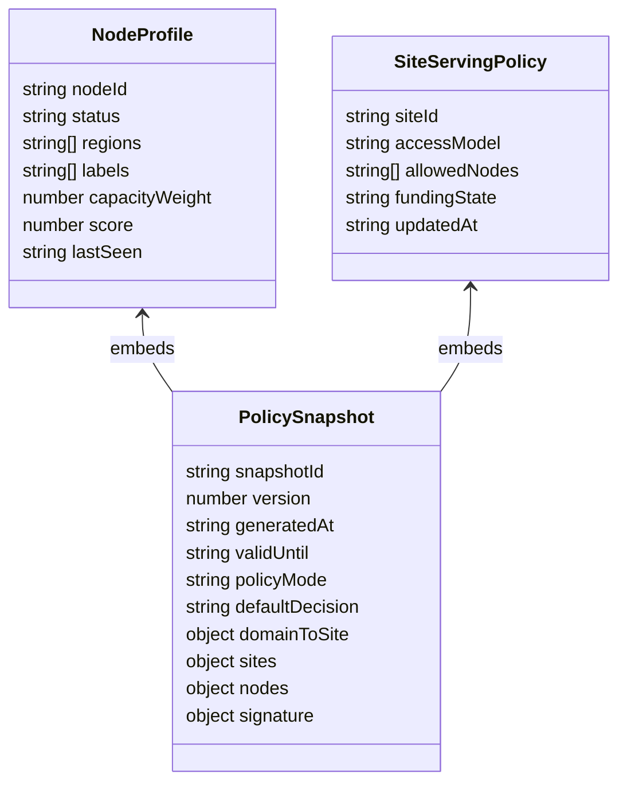
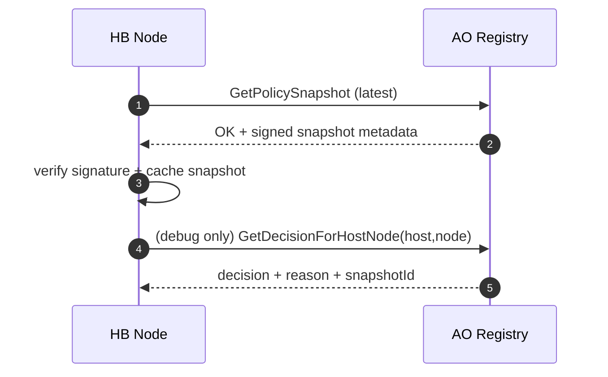

# HB policy contract draft (AO)

Date: 2026-04-21  
Status: Draft (P0 contract layer; non-disruptive defaults)

## 1) Scope

Defines AO action contracts for Darkmesh policy-driven HB serving and future reward-pool eligibility.

This draft is **contract-first** and must not change live serving behavior while global policy mode is `off`.

## 2) Design invariants

- Source of truth is AO state.
- Edge decision latency must use local snapshot cache (no per-request chain dependency).
- All responses use strict envelope:
  - `{ "status": "OK", "payload": ... }`
  - `{ "status": "ERROR", "code": "...", "message": "..." }`
- If mode is `off`, effective decision is `allow` by default.

## 3) Action groups

## 3.1 Read actions

- `GetPolicySnapshot`
- `GetSiteServingPolicy`
- `GetHBNodeProfile`
- `GetDecisionForHostNode`

## 3.2 Write/admin actions

- `RegisterHBNode`
- `UpdateHBNodeStatus`
- `SetSiteServingPolicy`
- `SetSiteFundingState`
- `SetPolicyMode`
- `PublishPolicySnapshot`
- `RevokePolicySnapshot`

## 4) Role gating

Mutating actions must require existing privileged roles (`admin` or `registry-admin`), aligned with current registry-gateway mutation policy.

## 5) Canonical data model



## 6) Request/response contracts (draft)

## 6.1 `GetPolicySnapshot` (read)

Request:

```json
{
  "Action": "GetPolicySnapshot",
  "Snapshot-Id": "optional_specific_id"
}
```

Response (`OK`):

```json
{
  "status": "OK",
  "payload": {
    "snapshotId": "snap_2026_04_21T09_00_00Z",
    "version": 1,
    "generatedAt": "2026-04-21T09:00:00Z",
    "validUntil": "2026-04-21T09:05:00Z",
    "policyMode": "off",
    "defaultDecision": "allow",
    "domainToSite": {},
    "sites": {},
    "nodes": {},
    "signature": {
      "alg": "ed25519",
      "keyId": "policy-root-2026-q2",
      "value": "base64sig"
    }
  }
}
```

## 6.2 `GetDecisionForHostNode` (read)

Request:

```json
{
  "Action": "GetDecisionForHostNode",
  "Host": "example.com",
  "Node-Id": "node_wallet_addr_1",
  "Policy-Mode": "optional_override_for_debug"
}
```

Response (`OK`):

```json
{
  "status": "OK",
  "payload": {
    "decision": "allow",
    "reason": "policy_mode_off",
    "mode": "off",
    "host": "example.com",
    "siteId": "site-demo-001",
    "nodeId": "node_wallet_addr_1",
    "snapshotId": "snap_2026_04_21T09_00_00Z"
  }
}
```

Reason enum draft:

- `policy_mode_off`
- `allowlisted`
- `funding_active`
- `host_unmapped_default_allow`
- `host_unmapped_default_deny`
- `node_not_allowed`
- `funding_inactive`
- `snapshot_invalid_fallback_allow`
- `snapshot_invalid_fallback_deny`

## 6.3 `SetPolicyMode` (write/admin)

Request:

```json
{
  "Action": "SetPolicyMode",
  "Mode": "off",
  "Default-Decision": "allow",
  "Request-Id": "uuid"
}
```

Rules:

- valid modes: `off|observe|soft|enforce`
- valid default decision: `allow|deny`
- idempotent by `Request-Id`

## 6.4 `RegisterHBNode` (write/admin)

Request:

```json
{
  "Action": "RegisterHBNode",
  "Node-Id": "node_wallet_addr_1",
  "Status": "online",
  "Regions": ["eu-central"],
  "Labels": ["darkmesh-pool"],
  "Capacity-Weight": 100,
  "Request-Id": "uuid"
}
```

## 6.5 `SetSiteServingPolicy` (write/admin)

Request:

```json
{
  "Action": "SetSiteServingPolicy",
  "Site-Id": "site-demo-001",
  "Access-Model": "allowlist",
  "Allowed-Nodes": ["node_wallet_addr_1"],
  "Request-Id": "uuid"
}
```

## 6.6 `SetSiteFundingState` (write/admin)

Request:

```json
{
  "Action": "SetSiteFundingState",
  "Site-Id": "site-demo-001",
  "Funding-State": "active",
  "Request-Id": "uuid"
}
```

Funding state enum draft:

- `active`
- `grace`
- `inactive`

## 6.7 `PublishPolicySnapshot` (write/admin)

Request:

```json
{
  "Action": "PublishPolicySnapshot",
  "Snapshot-Id": "snap_2026_04_21T09_00_00Z",
  "Version": 1,
  "Generated-At": "2026-04-21T09:00:00Z",
  "Valid-Until": "2026-04-21T09:05:00Z",
  "Snapshot-Tx": "arweave_tx_or_ref",
  "Signature-Ref": "sig_ref",
  "Request-Id": "uuid"
}
```

Invariants:

- `Version` must be monotonic increasing.
- older or duplicate snapshot version must be rejected.

## 7) Decision flow (AO side reference)



## 8) Non-disruptive semantics

When global mode is `off`:

- `GetDecisionForHostNode` must return `allow` unless request is malformed.
- No existing domain routing contract (`GetSiteByHost`, `ResolveGatewayForHost`) should change behavior.
- Snapshot read/write paths may be active, but serving decisions remain equivalent to current runtime.

## 9) Error code draft

- `INVALID_INPUT`
- `FORBIDDEN`
- `NOT_FOUND`
- `CONFLICT` (non-monotonic snapshot version)
- `SIGNATURE_INVALID`
- `UNSUPPORTED_FIELD`

## 10) Test requirements (P0)

- Contract smoke for every new action.
- Idempotency checks for all mutating actions.
- Explicit `off` mode parity test:
  - baseline `GetSiteByHost` behavior unchanged,
  - baseline `ResolveGatewayForHost` behavior unchanged,
  - `GetDecisionForHostNode` returns `allow` + `policy_mode_off` reason.

## 11) Migration mapping to other repos

- `blackcat-darkmesh-write`: operator mutation wrappers for write/admin actions.
- `blackcat-darkmesh-gateway`: local evaluator + snapshot cache/verify implementation.
- `blackcat-darkmesh-web`: admin tier controls and policy status views.

## 12) Open items

- final choice between policy deny response shaping (`403` vs masked `404`) at edge.
- final payout-evidence schema and retention period.
- signature key rotation workflow and key-id rollout cadence.

## 13) Resolver process scaffold integration notes (2026-04-22)

Implemented a v1 AO scaffold process at:

- `ao/resolver/process.lua`

Current scaffold contract wiring:

- Public read action `ResolveHostForNode` returns a deterministic decision payload.
- Safe debug read action `GetResolverState` returns summary only (no sensitive dump).
- State defaults are explicitly non-disruptive:
  - `policyMode = off`
  - `failOpen = true`
  - cache hints present (`positiveTtlSec`, `negativeTtlSec`, `staleWhileRevalidateSec`).
- Placeholder maps are initialized for future enforcement/data pipelines:
  - `hostPolicies`
  - `sitePolicies`
  - `dnsProofState`

Decision semantics in this scaffold:

- `off` mode always returns `decision=allow` with mode-off reason codes.
- Non-off modes currently still fail open (allow) with scaffold reason codes.
- No deny enforcement path is active in this process yet.

This keeps serving parity while enabling HB route integration to start consuming a
stable resolver response shape before policy enforcement is introduced.

## 14) Resolver scaffold wave-2 integration notes (2026-04-22)

The resolver scaffold now supports policy bundle ingestion and dns-proof-aware
decision shaping while preserving production-safe defaults.

Added action:

- `ApplyPolicyBundle` (admin/registry-admin role-gated)
  - accepts bundle snapshots for:
    - host policies (`hostPolicies`)
    - site policies (`sitePolicies`)
    - dns proof states (`dnsProofState`)
  - supports applying:
    - `policyMode`
    - `failOpen`
    - cache hint overrides
  - stores latest bundle metadata (`snapshotId`, `version`, `generatedAt`, `appliedAt`)

Decision behavior updates (`ResolveHostForNode`):

- `dnsProofState=valid` -> `allow` (`ALLOW_DNS_PROOF_VALID`)
- `dnsProofState=expired|missing`:
  - mode `off|observe` -> allow reasons (`ALLOW_DNS_PROOF_*_MODE_*`)
  - mode `soft|enforce` -> deny-ready reasons (`DENY_READY_DNS_PROOF_*`)
    - if `failOpen=true` (default): still returns `allow`
    - if `failOpen=false`: returns `deny`

Response cache metadata now includes:

- `cache.expiresAt`
- `cache.dnsNextCheckAt`

This keeps rollout safety (`failOpen=true` by default), but gives HB routing and
observability layers deterministic deny-ready signals for controlled migration to
soft/enforce modes.

## 15) Resolver route-level decision surface (2026-04-22)

Added read action:

- `ResolveRouteForHost`
  - request fields: `Host`, `Path`, `Method` (+ optional `Policy-Mode`, `Node-Id`)
  - response includes:
    - `decision`
    - `reasonCode`
    - `site` / `process` hints (when host is mapped)
    - `routeHint.actionHint` + `routeHint.source`
    - cache metadata (`ttlSec`, `expiresAt`, `dnsNextCheckAt`)

Bundle support was extended with optional `routePolicies`:

- per-host default action hint
- ordered route rules with `pathPrefix`, optional `methods`, and `actionHint`

Route-level reason codes map to contract categories:

- `ALLOW_*` examples:
  - `ALLOW_ROUTE_HOST_UNMAPPED_MODE_OFF`
  - `ALLOW_ROUTE_HOST_UNMAPPED_MODE_OBSERVE`
  - `ALLOW_DNS_PROOF_VALID`
- `DENY_READY_*` examples:
  - `DENY_READY_ROUTE_HOST_UNMAPPED`
  - `DENY_READY_DNS_PROOF_EXPIRED`
  - `DENY_READY_DNS_PROOF_MISSING`
- `ERROR_*` example:
  - `ERROR_INVALID_POLICY_MODE_FALLBACK`

Rollout safety remains unchanged:

- defaults are still `policyMode=off` and `failOpen=true`
- in `off/observe`, route resolution stays non-breaking allow
- in `soft/enforce`, deny-ready reasons are emitted, and hard deny only activates
  when `failOpen=false` is explicitly applied.

## 16) Resolver cache contract hardening (2026-04-22)

Resolver now exposes explicit cache-policy and cache-state semantics for
gateway/read-path determinism:

- positive cache TTL
- negative cache TTL
- stale-while-revalidate window

Read responses (`ResolveHostForNode`, `ResolveRouteForHost`) now return cache
metadata with deterministic markers:

- `cache.cacheState` (`miss|hit|negative_hit|stale`)
- `cache.hit`
- `cache.negative`
- `cache.stale`
- `cache.staleWhileRevalidate`
- `cache.expiresAt`
- `cache.staleUntilAt`
- `cache.revalidateAfterAt`

Additional safe read/admin actions:

- `GetResolverCacheStats` (safe read)
- `InvalidateResolverCache` (admin: `host|site|all`)

Mode safety invariants are preserved:

- `off` stays fail-open/non-breaking
- `observe` stays fail-open/non-breaking
- `enforce` behavior remains controlled by explicit `failOpen` toggle
